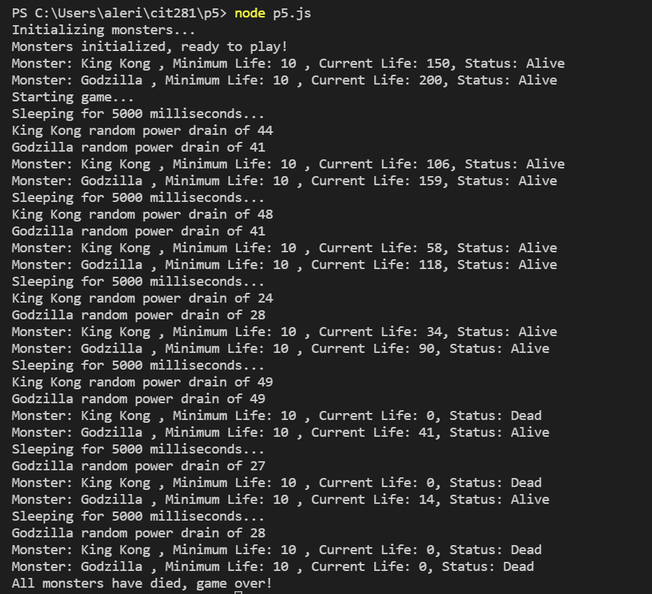

## Techniques Used 

- Exporting modules
- Non-web server Node.js JavaScript code
    - Lambda expressions
    - Object destructuring
    - Ternary operaters
    - Classes
    - constructor() method
    - .forEach() array method
    - template literals
    - console.log() method

## Objectives


### Create a file which hold a "monster" class. This class will contain information about the monster and functions to randomly drain the monster's life amount
```
module.exports = class Monster {
    constructor({monsterName = 'Unknown', minimumLife = 0, currentLife = 100}) {
       this.monsterName = monsterName
       this.minimumLife = minimumLife
       this.currentLife = currentLife 
       this.isAlive = currentLife >= minimumLife ? true : false

    } 
    updateLife = (lifeChangeAmount) => {
        this.currentLife = this.currentLife - lifeChangeAmount;
        this.currentLife < 0 ? this.currentLife = 0 : this.currentLife;
        this.isAlive = this.currentLife > this.minimumLife ? true : false
    }
    randomLifeDrain = (minimumLifeDrain, maximumLifeDrain) => {
        function getRandomInteger(min, max) {
            return Math.floor(Math.random() * (max - min) + min);
        }
        let randomLifeDrain = getRandomInteger(minimumLifeDrain, (maximumLifeDrain + 1))
        this.updateLife(randomLifeDrain)
        console.log(`${this.monsterName} random power drain of ${randomLifeDrain}`)

    }
}
```
### Update [p5-monster-game.js](https://lizz02.github.io/cit281-p5/p5-monster-game.js) with a function to list each monster and its data from the "monster" class in the console  

```
// List monsters
  listMonsters = () => this.monsters.forEach((monster) => console.log(`Monster: ${monster.monsterName} , Minimum Life: ${monster.minimumLife} , Current Life: ${monster.currentLife}, Status: ${monster.isAlive == true ? "Alive" : "Dead"}`));
```


Main entry point for game (provided by proffesor):

[p5.js](https://lizz02.github.io/cit281-p5/p5.js)

Result example:


